# Jeu en VR - "Traversée du Canyon"

## Table of Contents

- [Résumé](#summary)
- [Description](#description)
- [Caractéristiques clés](#Caractéristiques-clés)
- [Image Moodboard](#image-moodboard)
- [Sons Moodboard](#Sons-moodboard)
- [Carte de l'environnement virtuel](#virtual-environment-map)
- [Draw.io Schema](#drawio-schema)

## Summary

"Traversée du Canyon", est un jeu de parkour VR où l'équilibre du joueur est son outil principal.

## Description

"Traversée du Canyon" est un jeu en réalité virtuelle (VR) immersif qui met au défi les joueurs de s'embarquer dans une aventure palpitante au cœur d'un canyon dangereux. L'objectif principal du jeu est de traverser le canyon périlleux en naviguant sur d'anciens ponts de corde tout en utilisant leur force et leur intelligence pour éviter de tomber dans l'abîme obscur en dessous. Le but ultime est d'atteindre la fin du canyon, où se trouve une grotte cachée remplie de richesses inestimables.

## Caractéristiques clés

1. **Navigation Suspense sur les Ponts de Corde :** Les joueurs doivent marcher sur d'anciens ponts de corde qui pendent dangereusement au-dessus d'un abîme apparemment sans fond. Ces ponts délabrés grincent et oscillent à chaque pas, transformant chaque mouvement en un test de courage.

2. **Effets Météorologiques Dynamiques :** De puissants vents balayent le canyon, faisant osciller les ponts de corde d'un côté à l'autre, intensifiant le défi. Les joueurs doivent s'adapter aux conditions changeantes et maintenir leur équilibre pour progresser.

3. **Environnement Immersif Riche :** Le jeu propose des visuels VR époustouflants qui plongent les joueurs dans la beauté rugueuse du canyon, des détails complexes des ponts à la splendeur grandiose du canyon lui-même.

4. **Conception de Niveaux Stimulante :** Le jeu propose une série de niveaux de plus en plus difficiles, chacun présentant de nouveaux obstacles, des dangers environnementaux et des casse-tête qui mettent à l'épreuve les compétences et la détermination du joueur.

## Image Moodboard

Art conceptuel et idées d'environnements

<table>
  <tr>
    <td>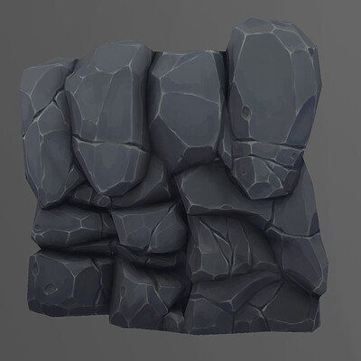</td>
    <td>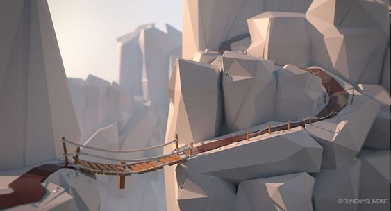</td>
  </tr>
    
  <tr>
    <td>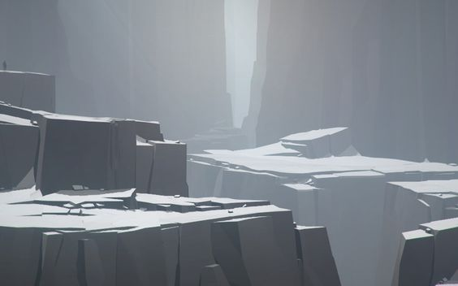</td>
    <td>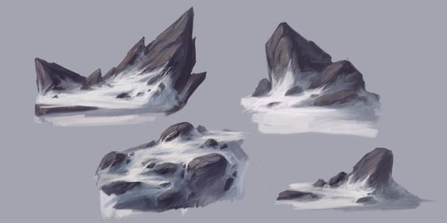</td>
  </tr>
    
  <tr>
    <td>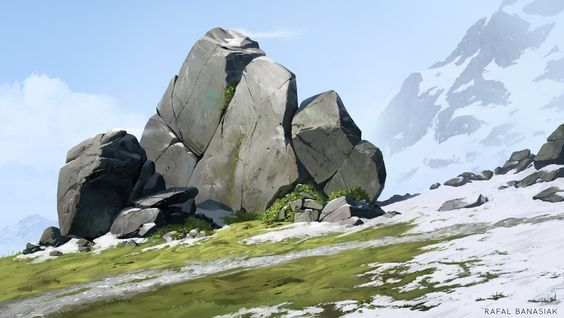</td>
    <td>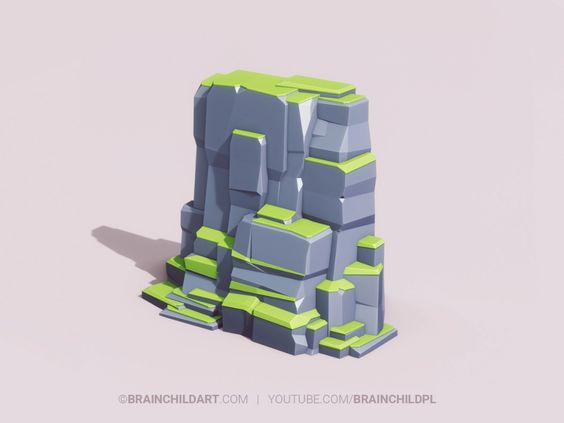</td>
  </tr>
</table>

Concepts et idées d'objets

<table>
  <tr>
    <td>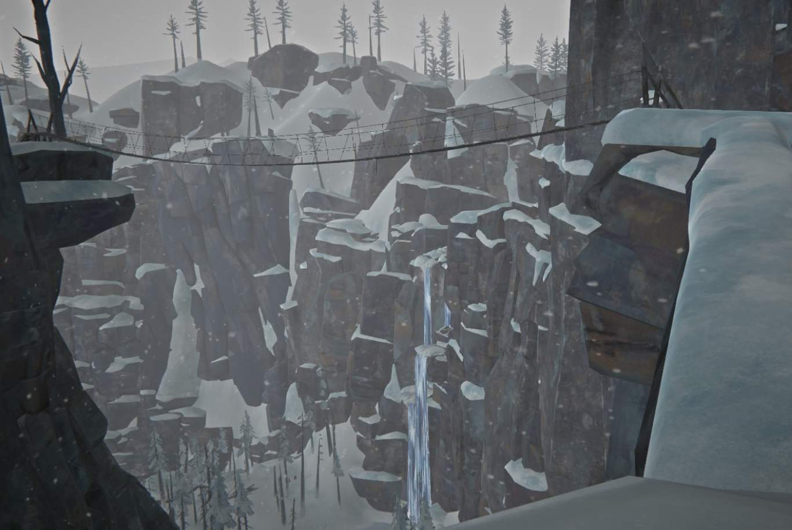</td>
    <td>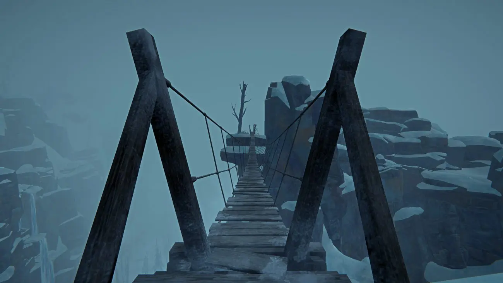</td>
  </tr>

  <tr>
    <td>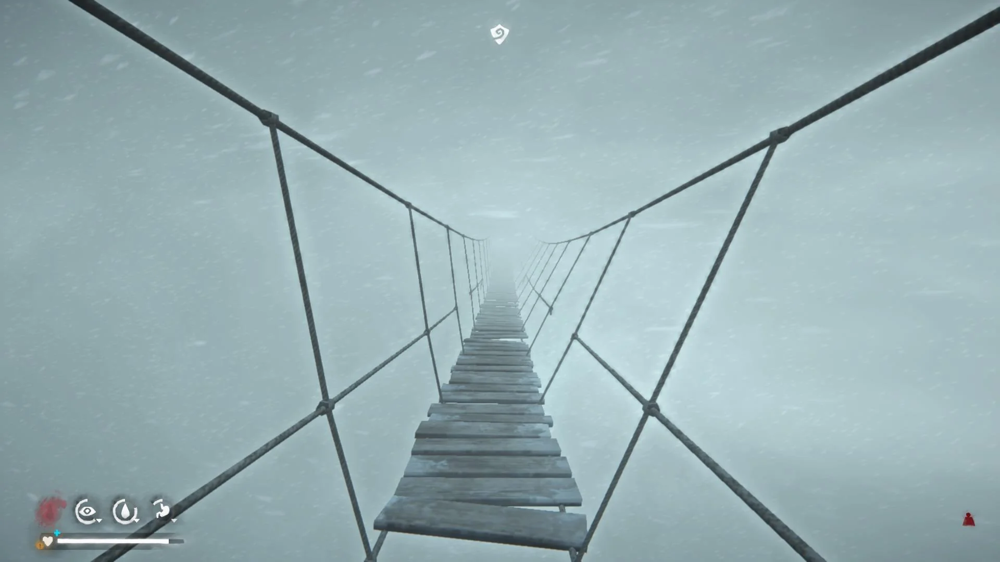</td>
    <td>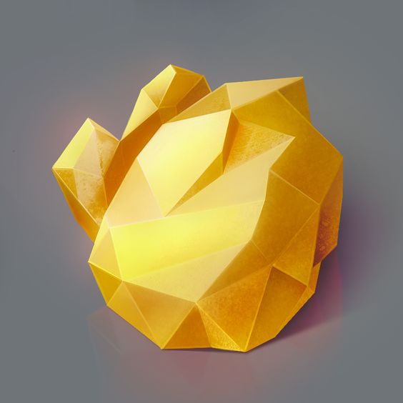</td>
  </tr>
  </table>

Prototypes d'objets

<table>
  <tr>
    <td>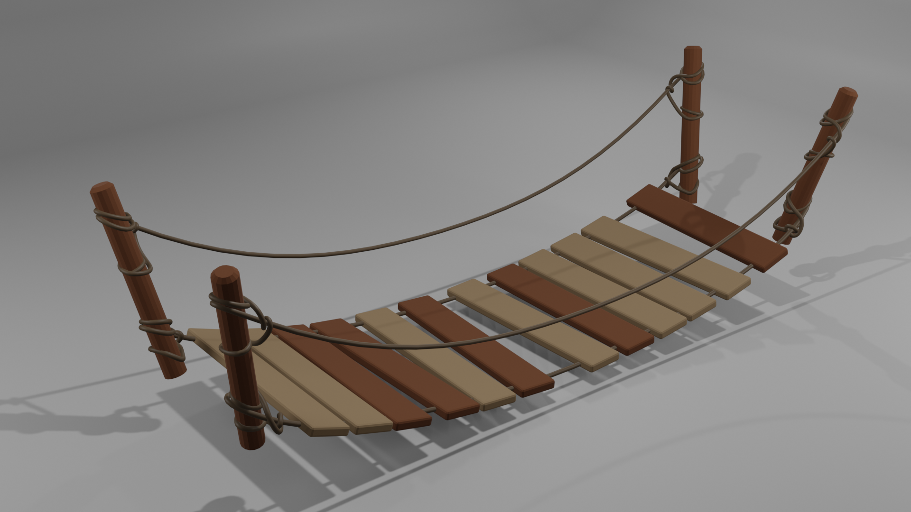</td>
    <td>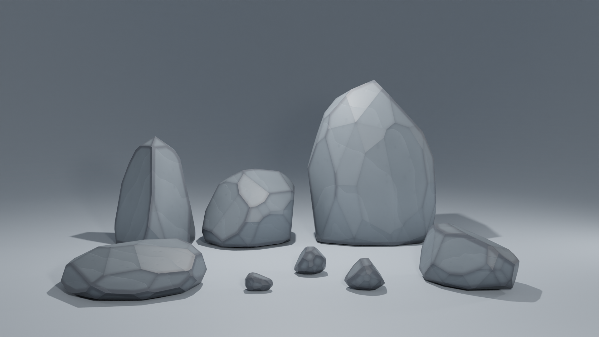</td>
  </tr>
  </table>

## Sons Moodboard

Une paire d'idées sonores pour la principale source sonore du jeu, le vent environnemental et le craquement du bois des ponts.

- [Sound 1-Vent (Link)](https://pixabay.com/sound-effects/wind-during-snow-storm-2-17562/)
- [Sound 2-Bois (Link)](https://pixabay.com/sound-effects/wooden-floor-cracking-37890/)

## Carte de l'environnement virtuel

Une carte de base de l'environnement virtuel dans votre jeu VR.

<td>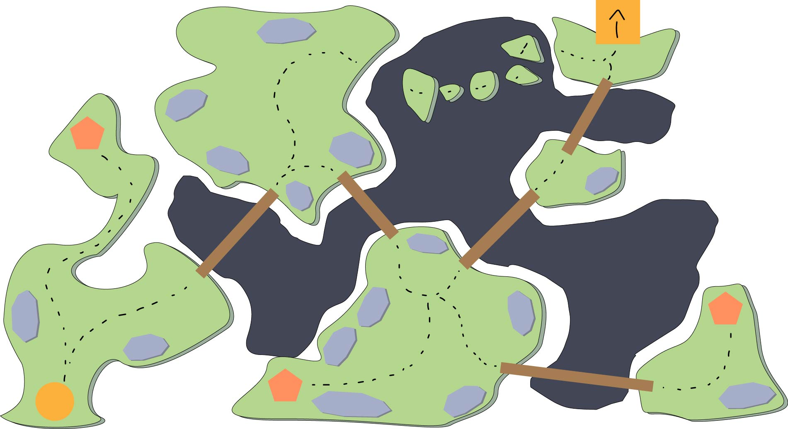</td>
<td>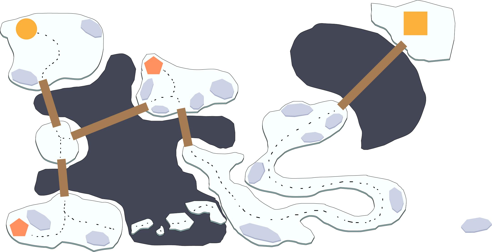</td>
<td>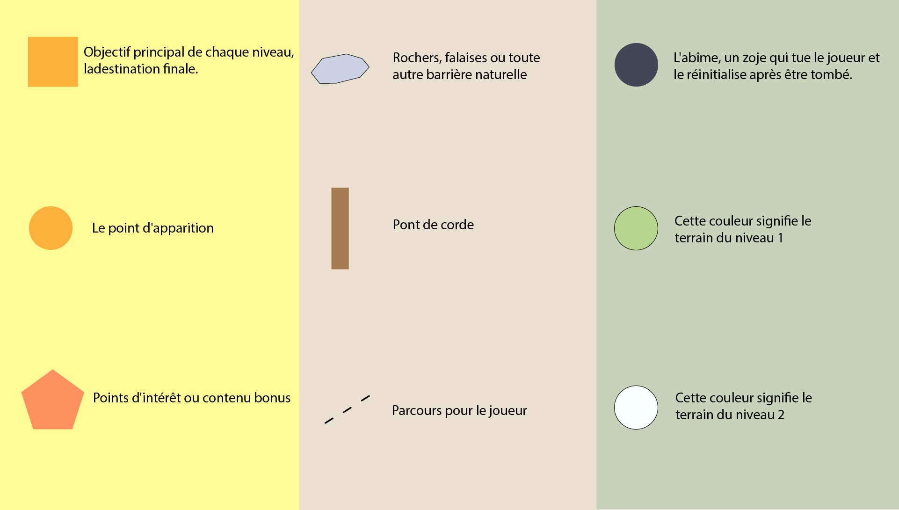</td>

## Drawio-schema

<td>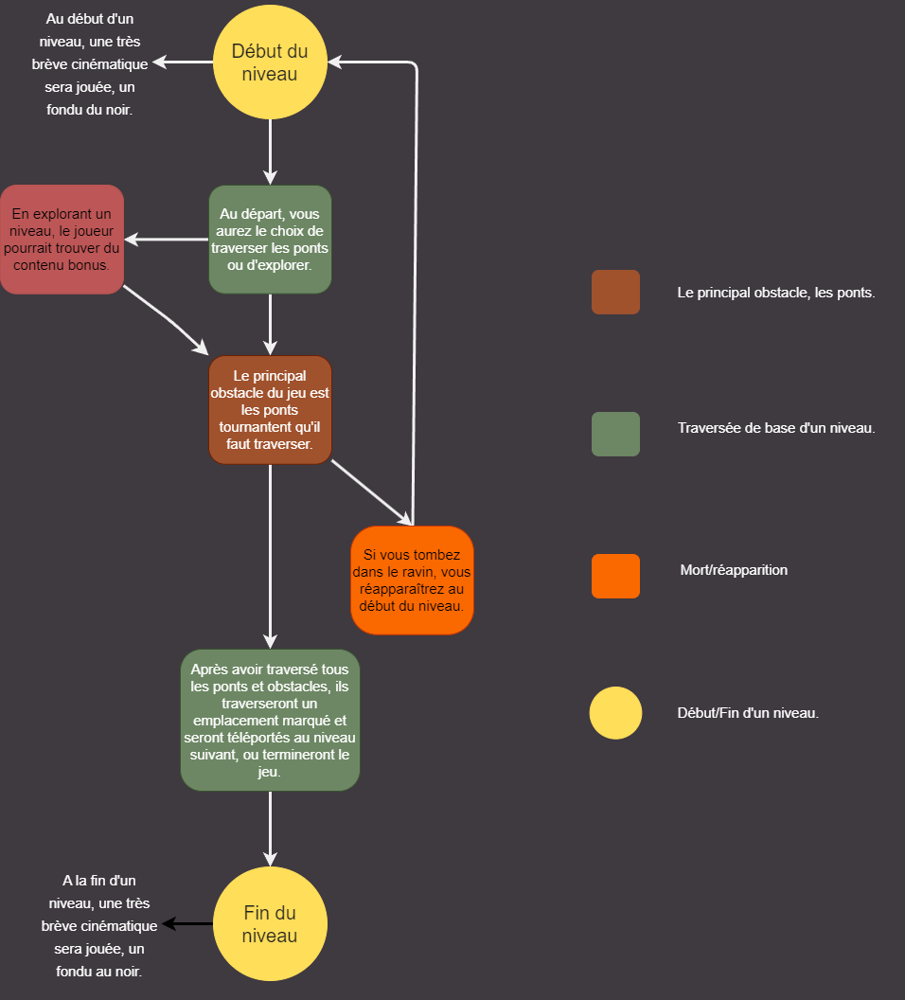</td>

